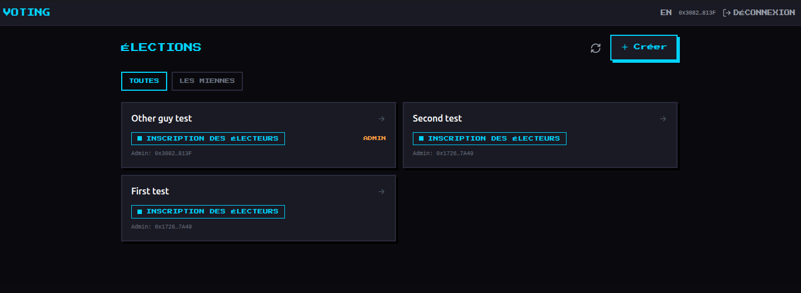
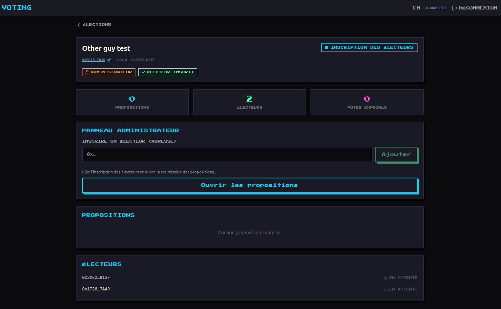
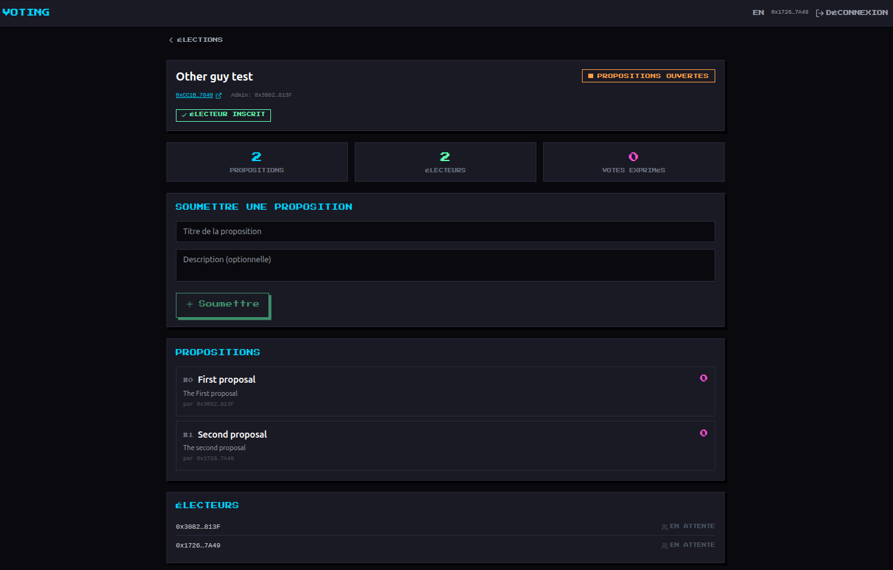
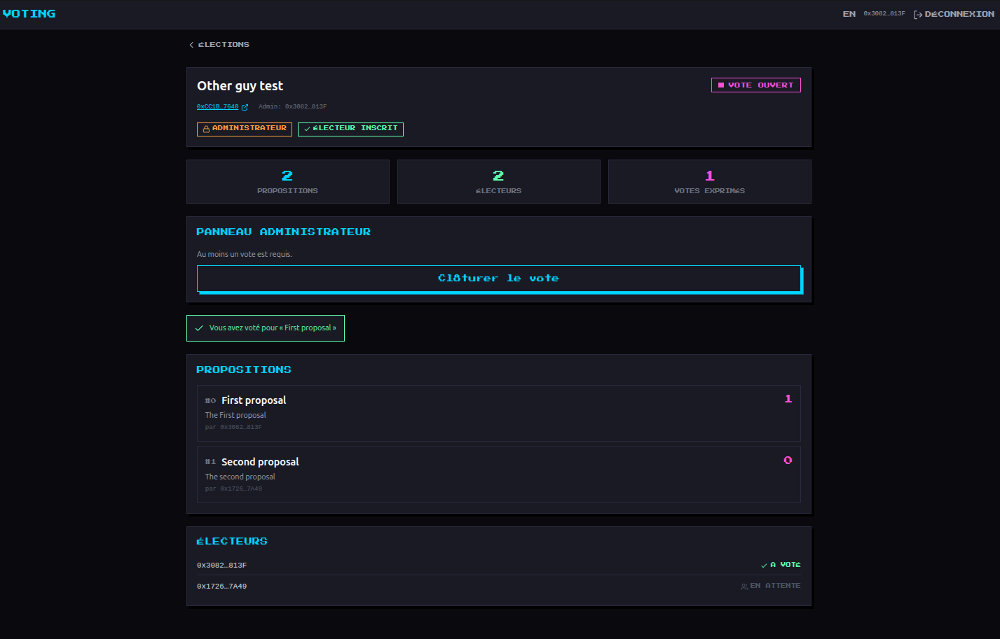
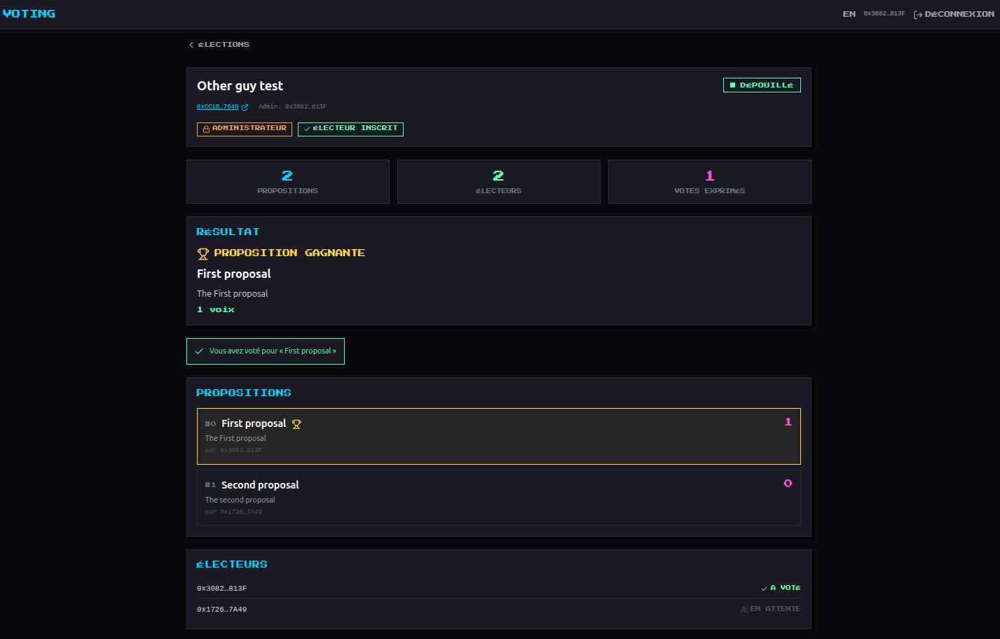

# Voting — dApp

Interface web3 pour la `VotingFactory` et les élections `VotingPlus`. Permet de
créer des élections, inscrire des électeurs, faire avancer le workflow, voter et
consulter le résultat (gagnant ou élection caduque) — directement on-chain.

> PoC associé à la branche [`factory`](../). Front basé sur la stack
> Vue 3 + Vite + Reown AppKit + ethers v6 +
> Pinia + vue-i18n + Tailwind.

## Aperçu

**Catalogue des élections** — toutes les élections déployées par la factory, avec le badge de statut, l'admin, et le filtre « les miennes » :



**Détail — phase d'inscription (vue administrateur)** — inscription des électeurs à la liste blanche, puis ouverture des propositions ; statistiques et liste des électeurs en direct :



**Phase des propositions (vue électeur)** — soumission d'une proposition (titre + description), liste des propositions avec leur auteur :



**Phase de vote** — vote pour une proposition, suivi de la participation (« A voté » / « En attente ») et confirmation de son propre vote :



**Résultat après dépouillement** — proposition gagnante mise en avant (ou message d'élection caduque en cas d'égalité) :



## Stack

- **Vue 3** (`<script setup>` + TypeScript) + **Vite**
- **Reown AppKit** (ex-WalletConnect) pour la connexion wallet (extensions + mobile)
- **ethers v6** pour les appels de contrat
- **Pinia** (stores `wallet`, `factory`, `election`)
- **vue-i18n** (FR / EN) · **Tailwind CSS**

## Configuration

```bash
cp .env.example .env
```

Renseignez dans `.env` :

| Variable | Rôle |
|---|---|
| `VITE_FACTORY_ADDRESS` | adresse de la `VotingFactory` déployée (pré-remplie) |
| `VITE_CHAIN_ID` | id de la chaîne (Sepolia = `11155111`, Holesky = `17000`) |
| `VITE_CHAIN_NAME` / `VITE_CURRENCY_SYMBOL` / `VITE_EXPLORER_URL` | affichage |
| `VITE_REOWN_PROJECT_ID` | **requis** — Project ID gratuit sur [cloud.reown.com](https://cloud.reown.com) |

> Sans `VITE_REOWN_PROJECT_ID`, la modale de connexion ne s'ouvre pas.

## Lancer

```bash
npm install
npm run dev        # http://localhost:1338
npm run build      # vérifie les types (vue-tsc) puis build de prod
```

## Architecture

```
src/
├── lib/
│   ├── appkit.ts      # init Reown AppKit (réseaux supportés)
│   ├── constants.ts   # adresse factory, chaîne, helpers explorer
│   ├── contract.ts    # ABIs Factory + VotingPlus, enum WorkflowStatus, parseError
│   └── format.ts       # shortAddress, eqAddress
├── stores/
│   ├── wallet.ts      # adaptateur Pinia sur AppKit (compte, chaîne, signer)
│   ├── factory.ts     # catalogue d'élections + createVoting
│   └── election.ts    # état + actions d'une élection (par adresse)
├── views/
│   ├── ConnectView.vue    # connexion wallet
│   ├── ElectionsView.vue  # catalogue (toutes / les miennes) + création
│   └── ElectionView.vue   # détail : panneau selon le rôle (admin/électeur/spectateur)
└── components/ui/     # UiButton, UiCard, UiModal, UiIcon, StatusBadge
```

### Comment l'app lit la chaîne

- **Catalogue** : `deployedVotingsCount()` puis `deployedVotings(i)` — la factory
  est la seule adresse à connaître.
- **Mes élections** : filtre sur `owner()` (event `VotingCreated.admin` indexé pour
  une indexation plus fine côté dapp).
- **Propositions** : lues par index jusqu'au revert de borne (aucun scan de logs).
- **Électeurs** : reconstruits depuis les events `VoterRegistered` (le mapping
  n'est pas itérable on-chain), avec repli sur le compte connecté si l'RPC refuse
  `getLogs`.
- **Rôle** : `owner()` → admin ; `voters(moi).isRegistered` → électeur ; sinon
  spectateur (lecture seule).

Les écritures passent par le signer ; chaque revert custom du contrat
(`WrongWorkflowStatus`, `AlreadyVoted`, `ElectionTied`…) est décodé en message
lisible (`lib/contract.ts → parseError`).
